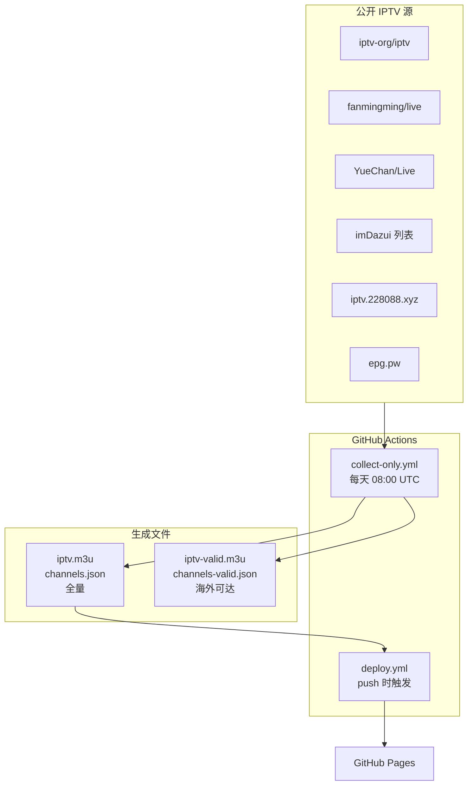
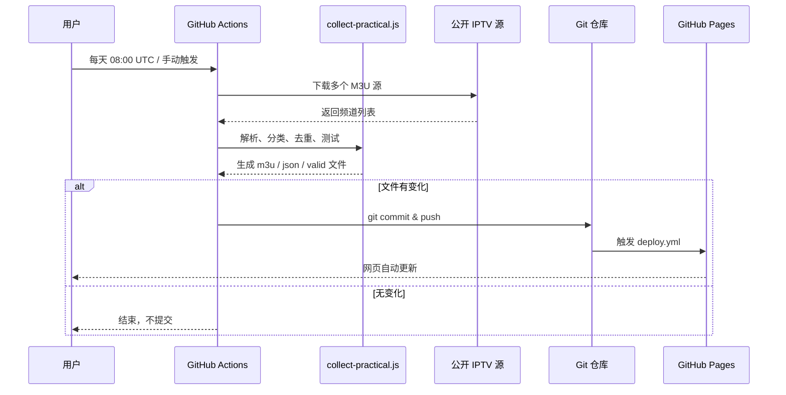

# 📺 IPTV 电视直播源收集器（自动化更新版）

🚀 **自动收集、测试和更新 IPTV 直播源**，每天自动运行，提供全量与验证两种频道列表。

[](https://github.com/Chaniug/IPTV-Collector/actions/workflows/deploy.yml)
[](https://github.com/Chaniug/IPTV-Collector/actions/workflows/collect-only.yml)


---

## ✨ 主要特性

| 特性 | 说明 |
|------|------|
| ⏰ **每天自动采集** | 北京时间每天 16:00 自动运行 GitHub Actions 采集最新源 |
| 📁 **双数据源输出** | 同时生成 `iptv.m3u`（全量）与 `iptv-valid.m3u`（海外可达） |
| 🏷️ **智能分类** | 基于频道名称自动归类为央视、卫视、卡通、新闻、体育、电影、其他 |
| 🧪 **自动验证** | 对频道进行 HEAD 可达性测试，生成有效源子集 |
| 🌐 **网页预览** | 通过 GitHub Pages 在线查看、筛选、测试频道 |
| ⚡ **CDN 加速** | 网页支持 jsDelivr / ghproxy 镜像订阅，国内访问更稳定 |
| 📥 **多格式支持** | 提供 M3U 播放列表与 JSON 数据两种格式 |

---

## 📡 订阅方式

### 方式一：订阅链接（推荐）

```text
https://chaniug.github.io/IPTV-Collector/iptv.m3u
```

*复制到 VLC、PotPlayer、TVBox 等播放器中订阅即可。*

#### CDN 加速订阅

国内访问 GitHub Pages 较慢时，可在网页右上角选择加速线路：

| 线路 | 订阅示例 |
|------|---------|
| 官方直连 | `https://chaniug.github.io/IPTV-Collector/iptv.m3u` |
| jsDelivr | `https://cdn.jsdelivr.net/gh/Chaniug/IPTV-Collector@master/iptv.m3u` |
| ghproxy | `https://ghproxy.com/https://raw.githubusercontent.com/Chaniug/IPTV-Collector/master/iptv.m3u` |

把对应链接的 `iptv.m3u` 换成 `iptv-valid.m3u` 即可订阅验证版。

### 方式二：直接下载

| 文件 | 说明 | 下载 |
|------|------|------|
| `iptv.m3u` | 全量频道列表 | [下载](iptv.m3u) |
| `channels.json` | 全量频道数据（JSON） | [下载](channels.json) |
| `iptv-valid.m3u` | 海外可达频道列表 | [下载](iptv-valid.m3u) |
| `channels-valid.json` | 海外可达频道数据（JSON） | [下载](channels-valid.json) |

### 方式三：在线预览

👉 **[https://chaniug.github.io/IPTV-Collector/](https://chaniug.github.io/IPTV-Collector/)**

网页版支持数据源切换、分类筛选、在线测试前 10 个频道。

---

## 🏗️ 系统架构



---

## 🔄 自动化流程



---

## 📊 频道分类

| 分类 | 关键词示例 | 说明 |
|------|-----------|------|
| **央视台** | CCTV、CETV、CGTN | 中央电视台及中国教育频道 |
| **卫视台** | 湖南卫视、浙江卫视、凤凰卫视 | 全国各大卫星电视台 |
| **卡通类** | 少儿、卡通、动漫、动画 | 儿童与动画频道 |
| **新闻类** | 新闻、资讯、NEWS | 新闻资讯类频道 |
| **体育类** | 体育、足球、篮球、奥运 | 体育赛事频道 |
| **电影类** | 电影、影院、剧场、影视 | 电影与影视剧场 |
| **其他台** | 地方台、专业频道等 | 未归入以上分类的频道 |

> 实际频道数量每天会变化，请查看 [`channels.json`](channels.json) 获取最新统计。

---

## 🛠️ 本地开发

```bash
# 克隆项目
git clone https://github.com/Chaniug/IPTV-Collector.git
cd IPTV-Collector

# 安装依赖
npm ci

# 手动采集最新源
npm run collect

# 测试频道可用性
npm run test

# 本地预览网页
npm start
# 浏览器访问 http://localhost:8080
```

### 项目结构

```
IPTV-Collector/
├── .github/workflows/
│   ├── collect-only.yml      # 每天自动采集
│   └── deploy.yml            # 部署到 GitHub Pages
├── scripts/
│   ├── collect-practical.js  # 主采集脚本
│   └── test-channels.js      # 频道抽样测试
├── app.js                    # 前端逻辑
├── index.html                # 网页入口
├── styles.css                # 样式
├── sources.txt               # 自定义采集源（每行一个）
├── iptv.m3u                  # 全量 M3U 输出
├── channels.json             # 全量 JSON 输出
├── iptv-valid.m3u            # 海外可达 M3U 输出
├── channels-valid.json       # 海外可达 JSON 输出
├── package.json
└── package-lock.json
```

---

## ⚙️ GitHub Actions 工作流

### `collect-only.yml` — 自动采集

| 配置项 | 值 |
|--------|-----|
| 触发时间 | 每天 08:00 UTC（北京时间 16:00） |
| 额外触发 | 手动触发 `workflow_dispatch` |
| Node 版本 | 20 |
| 主要输出 | `iptv.m3u`、`channels.json`、`iptv-valid.m3u`、`channels-valid.json` |
| 提交策略 | 仅当文件发生变化时才 commit & push |

### `deploy.yml` — 部署网页

| 配置项 | 值 |
|--------|-----|
| 触发条件 | `master` 分支 push / 手动触发 |
| 功能 | 将仓库部署到 GitHub Pages |

---

## 🔍 故障排除

### ❓ 频道无法播放

1. **源已失效**：直播源时效性强，等待下次自动更新或手动运行 `npm run collect`。
2. **网络限制**：部分国内源在海外无法播放，国内用户建议使用全量源 `iptv.m3u`。
3. **播放器兼容性**：尝试 VLC、PotPlayer、TVBox 等不同播放器。

### ❓ 网页无法访问

1. 检查 [GitHub Actions](https://github.com/Chaniug/IPTV-Collector/actions) 是否运行成功。
2. 确认仓库 Settings → Pages 已启用 GitHub Actions 部署源。
3. 备用地址：`https://raw.githubusercontent.com/Chaniug/IPTV-Collector/master/iptv.m3u`

### ❓ 频道分类不正确

1. 编辑 `scripts/collect-practical.js` 中的 `categorizeChannel` 函数。
2. 提交 issue 或 pull request 反馈分类错误。

---

## 🤝 贡献指南

1. Fork 本项目
2. 在本地运行 `npm run collect` 验证改动
3. 提交 Pull Request

### 提交新源

- 确保源为公开且稳定
- 优先选择国内可访问、海外也能通的源
- 编辑 `sources.txt` 添加源地址（每行一个），无需修改代码

### 自定义采集源

项目支持两种自定义源配置方式，优先级：`sources.txt` > `sources.json` > 内置默认。

#### 方式一：sources.txt（推荐）

在项目根目录创建或编辑 `sources.txt`，每行一个源地址，`#` 开头为注释：

```text
# 我的自定义 IPTV 源
https://example.com/iptv.m3u
https://mirror.example.com/live.m3u
```

#### 方式二：sources.json

在项目根目录创建 `sources.json`，格式如下：

```json
[
  "https://example.com/iptv.m3u",
  "https://mirror.example.com/live.m3u"
]
```

或：

```json
{
  "sources": [
    "https://example.com/iptv.m3u",
    "https://mirror.example.com/live.m3u"
  ]
}
```

保存后运行 `npm run collect` 或在 GitHub Actions 中手动触发即可生效。

---

## ⏰ 自动化时间表

| 时间（UTC） | 时间（北京时间） | 工作流 | 动作 |
|------------|----------------|--------|------|
| 08:00 | 16:00 | `collect-only.yml` | 采集、验证、提交 |
| push 时 | 即时 | `deploy.yml` | 部署 GitHub Pages |
| 手动触发 | 即时 | 均可 | 立即执行 |

---

## ⚠️ 免责声明

⚠️ **本项目仅供学习和技术交流使用**

1. 所有直播源均来自互联网公开资源。
2. 请遵守当地法律法规，合理使用。
3. 不得用于商业用途。
4. 使用即表示同意自行承担所有风险。

---

## 📞 相关链接

- **GitHub 项目**: [Chaniug/IPTV-Collector](https://github.com/Chaniug/IPTV-Collector)
- **Actions 状态**: [查看运行状态](https://github.com/Chaniug/IPTV-Collector/actions)
- **网页预览**: [chaniug.github.io/IPTV-Collector](https://chaniug.github.io/IPTV-Collector/)

---

## 🔄 更新日志

### 2026-06-21
- ✅ 修复 GitHub Actions npm 缓存警告
- ✅ 重构采集脚本，增加多个公开源
- ✅ 生成全量 + 海外可达双数据源
- ✅ 网页新增数据源切换功能
- ✅ 网页新增 jsDelivr / ghproxy CDN 加速订阅
- ✅ 支持 `sources.txt` / `sources.json` 自定义采集源
- ✅ 优化 Actions 提交策略，无变化不提交
- ✅ 重写 README，增加架构图与流程图

**🎉 特别感谢**: [iptv-org/iptv](https://github.com/iptv-org/iptv) 和所有贡献者提供的公开源

**⭐ 如果这个项目对您有帮助，请在 GitHub 上点个 Star！**